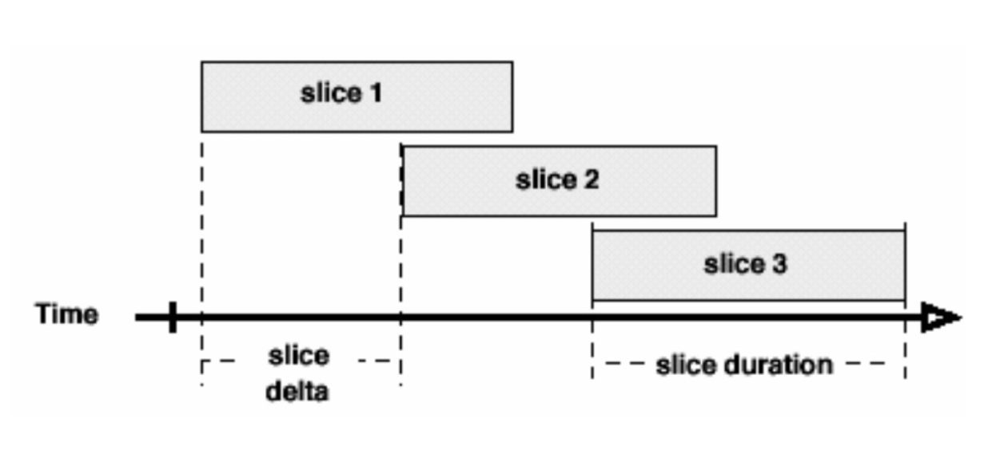

# Introduction

The goal of this investigation is to construct classification models capable of accurately detecting Activities of Daily Living (ADL). The modern society strongly emphasizes the importance of valuing one??s well-being. For example, Misfit, Fitbit, and other wearable fitness trackers are widely used to examine people??s fitness and health conditions. Companies like Spotify use classification algorithms to queue up songs based on users?? activity detected by phone movement, which will be different for running than for lifting weights. Other applications even include assistive rehabilitation devices that can assist the physically impaired in completing basic tasks such as brushing their teeth or sipping from a glass of water. The development of accurate and generalizable ADL recognition will establish a strong basis for improving the quality of human lives.

The data set, obtained from the UCI Machine Learning Repository, contains recordings of 14 ADL: `Brush Teeth`, `Climb Stairs`, `Comb Hair`, `Descend Stairs`, `Drink Glass`, `Eat Meat`, `Eat Soup`, `Get Up Bed`, `Lie down Bed`, `Pour Water`, `Sit Down Chair`, `Stand Up Chair`, `Use Telephone`, and `Walk`. Recordings of individuals performing each activity were gathered using wrist-worn triaxial accelerometers from 16 volunteers.

```{r, message=FALSE, warning=FALSE, echo=FALSE}
library(rlist)
library(flexclust)
library(gbm)
library(caret)
library(ape)
library(randomForest)
library(knitr)
library(kableExtra)
```

# Methods

```{r echo=FALSE}
# Load data
# use this to load raw data
load_data = function(data_path){
  num_action = 0
  # element n is the actual name of class n
  class_to_actions = list()
  data_matrix = list()
  index = 0
  
  # each row is a file, the first element of a row is its class(1-14), the rest are flattened (through each time unit) 3 dimension data
  
  for (action in list.files(path = data_path)){
    action_path = paste(data_path, action, sep = "/")
    num_action = num_action + 1
    class_to_actions[num_action] = action
    
    for (file in list.files(path = action_path)){
      file_name = paste(action_path, file, sep = "/")
      data = read.table(file_name)
      index = index + 1
      data_matrix[[index]] = c(num_action, as.list(t(data)))
    }
  }
  return(data_matrix)
}
```

### Preprocessing - Vector Quantization

Raw data were collected at 50 hertz by a single triaxial accelerometer attached to each volunteer??s right wrist. The ith observation of the raw data contains acceleration measured in the x, y, and z axes which correspond to the following directions of motion:

- x axis: pointing toward the hand (Vertical)
- y axis: pointing toward the left (Mediolateral)
- z axis: perpendicular to the plane of the hand (Anteroposterior)

Acceleration measurements, originally encoded in units of gravity (-1.5g to +1.5g), were mapped to integer values ranging from 0 to 63.

Due to the nature of different activities, the length of each recording can vary. As such, the data are unstructured and cannot be used directly for classification. To convert the data into a format useful for classification, vector quantization was used.

First, the raw data were segmented using a sliding window. Both window length $s$ and overlap $o$ were tuned using cross validation. Following segmentation, the two-dimensional signal was flattened into a vector and used as input for k-means clustering to group segments into $k$ clusters.



Then, for each activity example, the number of its segments belonging to each cluster are counted. The final feature vector for this observation is a vector $v$ with length $k$ where $v_i, (i = 1..k)$ represents the number of segments that belong to the ith cluster. This process was repeated for each activity example and the final data set was split 50/50 into train/test sets stratified by activity type.

```{r echo=FALSE}
# Process data
fit = function(input_data, cut_size, overlap=0, num_clusters){
  cutted_signals = list()
  index = 0
  for (observation in input_data){
    index = index + 1
    cutted_signals = c(cutted_signals, cut_signal(observation[-1], cut_size, overlap))
  }
  matrix_signals = matrix(unlist(cutted_signals), ncol=3*cut_size, byrow=T)
  model = flexclust::kcca(matrix_signals, k=num_clusters, kccaFamily("kmeans"))
  
  return(model)
}

cut_signal = function(input_data, cut_size, overlap=0){
  result_data = list()
  input_data_size = length(input_data)
  input_data_idx = 1
  result_data_idx = 1

  while (input_data_idx + cut_size*3 < input_data_size){
    result_data[[result_data_idx]] = input_data[input_data_idx:(input_data_idx+cut_size*3-1)]
    input_data_idx = input_data_idx + cut_size*3 - overlap*3
    result_data_idx = result_data_idx + 1
  }
  return(result_data)
}

# the returned data is a datafrane with num_clusters+1 columns. The last column is its label.
transform = function(model, input_data, cut_size, overlap, num_clusters){
  features = list()
  index = 0
  for (observation in input_data){
    index = index + 1
    cutted_signals = cut_signal(observation[-1], cut_size, overlap)
    matrix_signals = matrix(unlist(cutted_signals), ncol=3*cut_size, byrow=T)
    pred_clusters = predict(model, matrix_signals)
    feature = count_cluster(pred_clusters, num_clusters)
    feature[num_clusters+1] = observation[1]
    features[[index]] = feature
  }
  dt_features = data.frame(matrix(unlist(features), ncol=num_clusters+1, byrow=T))
  colnames(dt_features)[num_clusters+1] = "class"
  return(dt_features)
}

count_cluster = function(pred_clusters, num_clusters){
  feature = 1:num_clusters+1
  for (i in 1:num_clusters){
    feature[i] = sum(pred_clusters==i)
  }
  return(feature)
}

# use this to process data
process_data = function(data_matrix, data_path, cut_size, overlap, num_clusters){
  model = fit(data_matrix, cut_size, overlap, num_clusters)
  data = transform(model, data_matrix, cut_size, overlap, num_clusters)
  data['class'] = as.factor(data$class)
  return(data)
}
```

### Predictive Modeling

Four types of statistical models were tuned in conjunction with preprocessing steps using 5-fold cross validation. The following table shows the chosen search space for each of the preprocessing parameters:

| Parameter           | Symbol  | Search Space  |
|:-------------------:|:-------:|:-------------:|
| Window Length  	    | $s$     | 1, 5, 10, 20  |
| Window Overlap      | $o$     | 0, 3, 5       |
| Number of Clusters  | $k$     | 5, 10, 20     |

Note that all the possible combinations of these four parameters were tested except for the case where overlap was greater than or equal to window length (i.e. $o \geq s$).

```{r echo=FALSE, message=FALSE, warning=FALSE}
data_path = "HMP_Dataset"

# Load raw data from the data file
data_matrix_raw = load_data(data_path)

# Preprocess the data by Vector Quantization
# preprocess_data will be called multiple times in parameter tuning since parameter of preprocessing also need to be tuned
data = process_data(data_matrix_raw, cut_size=10, overlap=0, num_clusters=10)

# Test-train split
set.seed(1337)
trainIndex = createDataPartition(data$class, p=0.7, list=FALSE,times=1)
data_trn = data[trainIndex,]
data_tst = data[-trainIndex,]
```

```{r echo=FALSE}
# Helper functions for parameter tuning to get the best result from the result data frame
get_best_result = function(result_df) {
  best = which(lin_svm_cv['Accuracy'] == max(lin_svm_cv$'Accuracy', na.rm = T))
  return(result_df[best,])
}
```

**Random Forest**

Random forests were tuned across all possible values of mtry (mtry = 1..n, where n is the total number of features).

```{r echo=FALSE, eval=FALSE}
# Tunning rf using preprocessing paramters
tune_rf = function(raw_data, cut_sizes, overlaps, nums_clusters, tst_trn_split){
  total_iter = length(cut_sizes) * length(overlaps) * length(overlaps)

  # only need to run once
  cv_5 = trainControl(method = "cv", number = 5)
  result = data.frame(matrix(1:6,ncol=6))
  colnames(result) = list("Cut size", "Overlap", "Num of features", "mtry", "Accuracy", "AccuracySD")
  result_idx = 1
  
  iter = 0
  start_time = Sys.time()
  
  # iterating through all possible parameters
  for (cut_size in cut_sizes){
    for (overlap in overlaps){
      for (num_clusters in nums_clusters){
        if (overlap >= cut_size){
          iter = iter + 1
          print(paste("Iteration: ", iter, "finished in ", Sys.time()-start_time, "mins. Total iter: ", total_iter))
          start_time = Sys.time()
          next
        }
        data = process_data(raw_data, cut_size=cut_size, overlap=overlap, num_clusters=num_clusters)
        data_trn = data[tst_trn_split,]
        data_tst = data[-tst_trn_split,]
        
        rf_cv_grid = expand.grid(mtry=1:num_clusters)
        rf_cv = train(class ~ . , data = data_trn,
                              method = "rf",
                              trControl = cv_5,
                              verbose = FALSE,
                              preProcess = c("center", "scale"),
                              tuneGrid = rf_cv_grid)
        
        for (row in 1:num_clusters){
          result[result_idx, ] = c(cut_size, overlap, num_clusters, rf_cv$results[row,1], rf_cv$results[row,2], rf_cv$results[row,4]) 
          result_idx = result_idx + 1
        }
        
        iter = iter + 1
        print(paste("Iteration: ", iter, "finished in ", Sys.time()-start_time, "s. Total iter: ", total_iter))
        start_time = Sys.time()
      }
    }
  }
  return(result)
}
```

```{r eval=FALSE, echo=FALSE}
# Tunning rf model parameters with helper function tune_rf
# Tunning parameter grid, mtry is all the possible value (1 to num_clusters)
cut_sizes = list(1, 5, 10, 20)
overlaps = list(0, 3, 5)
nums_clusters = list(5, 10, 20)

# Test train split to be passed to the tuning function
set.seed(1337)
trainIndex = createDataPartition(1:length(data_matrix_raw), p=0.7, list=FALSE,times=1)

# Tunning function, retrun result in data from
rf_cv = tune_rf(data_matrix_raw, cut_sizes=cut_sizes, overlaps=overlaps, nums_clusters=nums_clusters, tst_trn_split=trainIndex)

# Find the best result and train 
best_result = get_best_result(rf_cv)
```

The best model with parameters tunned from the above search space is constructed and presented below. We calculate its training and testing accuracy

```{r echo=FALSE}
cv_5 = trainControl(method = "cv", number = 5)

# Preprocess data with best parameters
data = process_data(data_matrix_raw, cut_size=1, overlap=0, num_clusters=20)
data_trn = data[trainIndex,]
data_tst = data[-trainIndex,]

# Train the rf with the preprocessed data with best parameters and predict the test data
rf_final = randomForest(class~., data=data_trn, mtry=8)
pred_rf_tst = predict(rf_final, data_tst)
pred_rf_trn = predict(rf_final, data_trn)

# Return test set accuracy
acc_rf_trn = confusionMatrix(pred_rf_trn, data_trn$class)$overall['Accuracy']
acc_rf_tst = confusionMatrix(pred_rf_tst, data_tst$class)$overall['Accuracy']
```

**Gradient Boosting Machine (GBM)**

Initially, a coarse range of tuning parameters were selected and iteratively narrowed to create smaller tuning grids for the GBM model due to the linear and relatively slow rate of training compared to other tree-based models. The accuracy and ??Best Tune?? of each model iteration was recorded and used to update the grid. This process reduces training time.

```{r echo=FALSE}
# GBM Grid/Parameter
gbm_grid = expand.grid(interaction.depth = 8,
                       n.trees = 1038,
                       shrinkage = 0.01,
                       n.minobsinnode = 10)

# 5-folds GBM Model
gbm_model_cv = train(class ~ ., 
                     data = data_trn, 
                     method = "gbm",
                     trControl = trainControl(method = "cv", number = 5),
                     tuneGrid = gbm_grid,
                     verbose = FALSE)

# Return train-test set accuracy
gbm_trn_pred =predict(gbm_model_cv, data_trn)
gbm_tst_pred = predict(gbm_model_cv, data_tst)
cm_gbm_trn = confusionMatrix(gbm_trn_pred, data_trn$class)
cm_gbm_tst = confusionMatrix(gbm_tst_pred, data_tst$class)
acc_gbm_trn = cm_gbm_trn$overall['Accuracy']
acc_gbm_tst = cm_gbm_tst$overall['Accuracy']
```

**K-Nearest Neighbors (KNN)**

Because KNN is a relatively simple and quick model compared to others used in this analysis, it was possible to test a wide range of parameters, or k-values, before testing. Specifically, parameters k between 3 and 100 (inclusive) were examined.

```{r echo=FALSE, eval=FALSE}
# tune KNN model
tune_knn = function(raw_data, cut_sizes, overlaps, nums_clusters, tst_trn_split){
  total_iter = length(cut_sizes) * length(overlaps) * length(overlaps)

  result_idx = 1
  
  iter = 0
  start_time = Sys.time()
  
  # iterating through all possible parameters
  for (cut_size in cut_sizes){
    for (overlap in overlaps){
      for (num_clusters in nums_clusters){
        if (overlap >= cut_size){
          iter = iter + 1
          print(paste("Iteration: ", iter, "finished in ", Sys.time()-start_time, "mins. Total iter: ", total_iter))
          start_time = Sys.time()
          next
        }
        data = process_data(raw_data, cut_size=cut_size, overlap=overlap, num_clusters=num_clusters)
        data_trn = data[tst_trn_split,]
        data_tst = data[-tst_trn_split,]
        
knn_cv = train(class ~ ., data = data_trn,
               method = "knn",
               trControl = cv_5,
               verbose = FALSE,
               preProcess = c("center", "scale"),
               tuneGrid = expand.grid(k = c(1:100)))
        
        for (row in 1:num_clusters){
          result[result_idx, ] = c(cut_size, overlap, num_clusters, knn_cv$results[row,1], knn_cv$results[row,2], knn_cv$results[row,4]) 
          result_idx = result_idx + 1
        }
        
        iter = iter + 1
        print(paste("Iteration: ", iter, "finished in ", Sys.time()-start_time, "s. Total iter: ", total_iter))
        start_time = Sys.time()
      }
    }
  }
  return(result)
}
```

```{r echo=FALSE}
# KNN results
cv_5 = trainControl(method = "cv", number = 5)

knn_final = train(class ~ ., data = data_trn,
               method = "knn",
               trControl = cv_5,
               preProcess = c("center", "scale"),
               tuneGrid = expand.grid(k = c(3:100)))
pred_knn = predict(knn_final, data_tst)

# return test set accuracy
cm_knn = confusionMatrix(pred_knn, data_tst$class)
cval = as.integer(which.max(knn_final$results$Accuracy))
```

```{r echo=FALSE}
# validate KNN results
knn_final_2 = train(class ~ ., data = data_trn,
               method = "knn",
               trControl = trainControl(method = "none"),
               preProcess = c("center", "scale"),
               tuneGrid = expand.grid(k = cval + 2))

# Return train-test set accuracy
pred_knn_trn =predict(knn_final_2, data_trn)
pred_knn_tst = predict(knn_final_2, data_tst)
cm_knn_trn = confusionMatrix(pred_knn_trn, data_trn$class)
cm_knn_tst = confusionMatrix(pred_knn_tst, data_tst$class)
acc_knn_trn = cm_knn_trn$overall['Accuracy']
acc_knn_tst = cm_knn_tst$overall['Accuracy']
```

**Support Vector Machine (SVM)**

Support vector machines using linear, polynomial, and gaussian kernels were trained across appropriate parameter search spaces using 5-fold cross validation. Optimal tuning parameters were selected on the basis of highest accuracy.

```{r echo=FALSE, eval=FALSE}
# Model and preprocessing tuning
# Function for tuning both SVM and data preprocessing
tune_linear_svm = function(raw_data, cut_sizes, overlaps, nums_clusters, tst_trn_split){
  total_iter = length(cut_sizes) * length(overlaps) * length(overlaps)

  # only need to run once
  cv_5 = trainControl(method = "cv", number = 5)
  result = data.frame(matrix(1:6,ncol=6))
  colnames(result) = list("Cut size", "Overlap", "Num of features", "mtry", "Accuracy", "AccuracySD")
  result_idx = 1
  
  iter = 0
  start_time = Sys.time()
  
  # iterating through all possible parameters
  for (cut_size in cut_sizes){
    for (overlap in overlaps){
      for (num_clusters in nums_clusters){
        if (overlap >= cut_size){
          iter = iter + 1
          print(paste("Iteration: ", iter, "finished in ", Sys.time()-start_time, "mins. Total iter: ", total_iter))
          start_time = Sys.time()
          next
        }
        data = process_data(raw_data, cut_size=cut_size, overlap=overlap, num_clusters=num_clusters)
        data_trn = data[tst_trn_split,]
        data_tst = data[-tst_trn_split,]
        
        lin_svm_cv_grid = expand.grid(C = c(1e-4, 1e-3, 1e-2, 1e-1, 1, 10, 100, 1000, 10000))
        lin_svm_cv = train(class ~ . , data = data_trn,
                          method = "svmLinear",
                          trControl = cv_5,
                          verbose = FALSE,
                          preProcess = c("center", "scale"),
                          tuneGrid = lin_svm_cv_grid)
        
        for (row in 1:num_clusters){
          result[result_idx, ] = c(cut_size, overlap, num_clusters, lin_svm_cv$results[row,1], lin_svm_cv$results[row,2], lin_svm_cv$results[row,4]) 
          result_idx = result_idx + 1
        }
        
        iter = iter + 1
        print(paste("Iteration: ", iter, "finished in ", Sys.time()-start_time, "s. Total iter: ", total_iter))
        start_time = Sys.time()
      }
    }
  }
  return(result)
}
```

```{r echo=FALSE, eval=FALSE}
# Tune SVM
cut_sizes = list(1, 5, 10, 20)
overlaps = list(0, 3, 5)
nums_clusters = list(5, 10, 20)

# test train split to be passed to the tuning function
set.seed(59999)
trainIndex = createDataPartition(1:length(data_matrix_raw), p=0.7, list=FALSE,times=1)

# tunning function, retrun result in data from
lin_svm_cv = tune_linear_svm(data_matrix_raw, cut_sizes=cut_sizes, overlaps=overlaps, nums_clusters=nums_clusters, tst_trn_split=trainIndex)

# find the best result and train 
best_result = get_best_result(lin_svm_cv)
```

```{r echo=FALSE}
# Best Linear SVM
#lin_svm_grid = expand.grid(C = c(1e-4, 1e-3, 1e-2, 1e-1, 1, 10, 100, 1000, 10000))
best_lin_svm_grid = expand.grid(C = c(1000))

lin_svm_mod = train(class ~ .,
                    data = data_trn,
                    method = "svmLinear",
                    preProcess = c("center","scale"),
                    trControl = trainControl(method = "none"),
                    tuneGrid = best_lin_svm_grid,
                    verbose = FALSE)

# Return train-test set accuracy
lin_trn_pred = predict(lin_svm_mod, data_trn)
lin_test_pred = predict(lin_svm_mod, data_tst)
acc_svm_lin_trn = confusionMatrix(lin_trn_pred, data_trn$class)$overall['Accuracy']
acc_svm_lin_tst = confusionMatrix(lin_test_pred, data_tst$class)$overall['Accuracy']
```

```{r echo=FALSE}
# Best Polynomial SVM
poly_svm_grid = expand.grid(degree = c(2,3,4,5),
                            scale = c(1, 1e-1, 1e-2, 1e-3, 1e-4),
                            C = c(1e-2, 1e-1, 1, 10, 100))

best_poly_svm_grid = expand.grid(degree = c(2),
                            scale = c(1),
                            C = c(10))

poly_svm_mod = train(class ~ .,
                    data = data_trn,
                    method = "svmPoly",
                    preProcess = c("center","scale"),
                    trControl = trainControl(method = "none"),
                    tuneGrid = best_poly_svm_grid,
                    verbose = FALSE)

# Return train-test set accuracy
poly_trn_pred =predict(poly_svm_mod, data_trn)
poly_tst_pred = predict(poly_svm_mod, data_tst)
acc_svm_poly_trn = confusionMatrix(poly_trn_pred, data_trn$class)$overall['Accuracy']
acc_svm_poly_tst = confusionMatrix(poly_tst_pred, data_tst$class)$overall['Accuracy']
```


```{r echo=FALSE}
# Best Gaussian SVM (also the best model of the three)
best_rbf_svm_grid = expand.grid(C = c(512),
                                sigma = c(0.5047778))

rbf_svm_mod = train(class ~ .,
                    data = data_trn,
                    method = "svmRadial",
                    preProcess = c("center","scale"),
                    trControl = trainControl(method = "none"),
                    tuneGrid = best_rbf_svm_grid,
                    verbose = FALSE)

# Return train-test set accuracy
rbf_trn_pred =predict(rbf_svm_mod, data_trn)
rbf_tst_pred = predict(rbf_svm_mod, data_tst)
acc_rbf_trn = confusionMatrix(rbf_trn_pred, data_trn$class)$overall['Accuracy']
acc_rbf_tst = confusionMatrix(rbf_tst_pred, data_tst$class)$overall['Accuracy']
```

# Results

A summary of the testing and training accuracy of each model is presented below:

```{r echo=FALSE}
# compile all the results together
acc_trn_all = c(acc_rf_trn, acc_svm_lin_trn, acc_svm_poly_trn, acc_rbf_trn, acc_knn_trn, acc_gbm_trn)
accE_tst_all = c(acc_rf_tst, acc_svm_lin_tst, acc_svm_poly_tst, acc_rbf_tst, acc_knn_tst, acc_gbm_tst)

row_names = c("Random Forest", "Linear SVM" , "Polynomial SVM" , "Gaussian SVM", "KNN" , "Gbm" )
col_names = c("Training Accuracy", "Testing Accuracy")

result = data.frame(acc_trn_all, accE_tst_all, row.names=row_names)
colnames(result) = col_names

# render the result table
kable_styling(kable(result, format = "html", digits = 7, format.args = list(big.mark = ",") ), full_width = FALSE)
```

The worst-performing model using k-nearest neighbors achieved an accuracy of 76.83%. This value is considerably lower than all other models which achieved accuracies near or above 80%. The best model, a gradient boosted machine, obtained an accuracy of 83.33% with the following parameters: Interaction Depth of 8, 1038 Trees, Shrinkage of 0.01, and 10 Minobsinnode. The confusion matrix for the GBM model can be seen below:

**GBM Confusion Matrix**
```{r echo=FALSE}
cm_gbm_tst$table
```

# Discussion

The aim of this paper is to develop a reliable activity recognition system using data from a wrist-worn accelerometer. While there are many publications detailing accurate models for activity classification--some which cover an even greater range of ADL than this current study--the majority of these investigations have been carried out using accelerometers mounted on the lower back or hip. While not inherently better than other locations, sensor placement at the wrist is advantageous in that many widely-adopted technologies such as smart watches and fitbits are already in use by the general population. Furthermore, these wrist-worn devices cause far less discomfort and would likely demonstrate greater adherence than sensors which must be attached to clothing near the back, hip, or other uncommon locations.

The average classification accuracy across all models was 80.66%. However, the most promising system utilized a gradient boosting machine that achieved an accuracy of 83.33%. The GBM confusion matrix displayed above highlights the weak points in activity classification. In particular, the model struggles to properly classify activities 11 and 12 (`sitdown chair` and `standup chair`). Initially, this was thought be due in part to the low number of instances in the training set. However, inspection of the training set revealed that `sitdown chair` and `standup chair` have 70 and 72 instances, respectively. This is greater than the average number of instances across all activity types which is 42. This suggests that the difficulty in classification is not simply due to a lack of training examples, but rather potential similarity between activity types. This makes sense intuitively given that sitting and rising from a chair are essentially the same action.

It should be noted that activity number 9 (`descend stairs`) showed fairly poor positive predictive value of 67%. It is interesting that the model exhibited difficulty in predicting this particular class given that a total of 20 examples were available in the training set. While this is not the largest representative sample, it is on par with some of the other classes which achieved fairly good positive prediction (e.g. class 3 `comb hair` achieved a PPV of 100% with only 22 training instances). It is possible that the poor performance on `descend stairs` is simply a result of the minimal number of examples in the testing set (only 8 instances), which allows for easy skewing of performance metrics. Alternatively, it may be that the features provided to the model are insufficient for discriminating this activity type. It would be ideal to obtain additional examples across all activity types to produce a data set which has a balanced class distribution. Upsampling of minority class examples may improve performance, but this approach is not ideal--especially compared to undersampling methods--since upsampling the minority class would require duplication of the current instances which may add unwanted bias to the model.

Given the importance of activity recognition, increases in either classification performance or diversity of activity types could provide substantial benefits to the community. Potential applications of this model beyond simple activity recognition could include monitoring of different physical activity levels which are tied to general health and aging. Alternatively, activity recognition technology could be adapted to intelligent assistive devices for individuals with disabilities. Admittedly, the sample size of this study likely does not capture the natural variation of the population which could lead to poor performance on an unseen population. Additional work in this area is necessary before developing truly universal and generalizable activity recognition systems.

# Appendix A (Code)

```{r, message=FALSE, warning=FALSE, eval=FALSE}
library(rlist)
library(flexclust)
library(gbm)
library(caret)
library(ape)
library(randomForest)
library(knitr)
library(kableExtra)
```

```{r eval=FALSE}
# Load data
# use this to load raw data
load_data = function(data_path){
  num_action = 0
  # element n is the actual name of class n
  class_to_actions = list()
  data_matrix = list()
  index = 0
  
  # each row is a file, the first element of a row is its class(1-14), the rest are flattened (through each time unit) 3 dimension data
  
  for (action in list.files(path = data_path)){
    action_path = paste(data_path, action, sep = "/")
    num_action = num_action + 1
    class_to_actions[num_action] = action
    
    for (file in list.files(path = action_path)){
      file_name = paste(action_path, file, sep = "/")
      data = read.table(file_name)
      index = index + 1
      data_matrix[[index]] = c(num_action, as.list(t(data)))
    }
  }
  return(data_matrix)
}
```

```{r eval=FALSE}
# Process data
fit = function(input_data, cut_size, overlap=0, num_clusters){
  cutted_signals = list()
  index = 0
  for (observation in input_data){
    index = index + 1
    cutted_signals = c(cutted_signals, cut_signal(observation[-1], cut_size, overlap))
  }
  matrix_signals = matrix(unlist(cutted_signals), ncol=3*cut_size, byrow=T)
  model = flexclust::kcca(matrix_signals, k=num_clusters, kccaFamily("kmeans"))
  
  return(model)
}

cut_signal = function(input_data, cut_size, overlap=0){
  result_data = list()
  input_data_size = length(input_data)
  input_data_idx = 1
  result_data_idx = 1

  while (input_data_idx + cut_size*3 < input_data_size){
    result_data[[result_data_idx]] = input_data[input_data_idx:(input_data_idx+cut_size*3-1)]
    input_data_idx = input_data_idx + cut_size*3 - overlap*3
    result_data_idx = result_data_idx + 1
  }
  return(result_data)
}

# the returned data is a datafrane with num_clusters+1 columns. The last column is its label.
transform = function(model, input_data, cut_size, overlap, num_clusters){
  features = list()
  index = 0
  for (observation in input_data){
    index = index + 1
    cutted_signals = cut_signal(observation[-1], cut_size, overlap)
    matrix_signals = matrix(unlist(cutted_signals), ncol=3*cut_size, byrow=T)
    pred_clusters = predict(model, matrix_signals)
    feature = count_cluster(pred_clusters, num_clusters)
    feature[num_clusters+1] = observation[1]
    features[[index]] = feature
  }
  dt_features = data.frame(matrix(unlist(features), ncol=num_clusters+1, byrow=T))
  colnames(dt_features)[num_clusters+1] = "class"
  return(dt_features)
}

count_cluster = function(pred_clusters, num_clusters){
  feature = 1:num_clusters+1
  for (i in 1:num_clusters){
    feature[i] = sum(pred_clusters==i)
  }
  return(feature)
}

# use this to process data
process_data = function(data_matrix, data_path, cut_size, overlap, num_clusters){
  model = fit(data_matrix, cut_size, overlap, num_clusters)
  data = transform(model, data_matrix, cut_size, overlap, num_clusters)
  data['class'] = as.factor(data$class)
  return(data)
}
```

```{r eval=FALSE}
# Process data
fit = function(input_data, cut_size, overlap=0, num_clusters){
  cutted_signals = list()
  index = 0
  for (observation in input_data){
    index = index + 1
    cutted_signals = c(cutted_signals, cut_signal(observation[-1], cut_size, overlap))
  }
  matrix_signals = matrix(unlist(cutted_signals), ncol=3*cut_size, byrow=T)
  model = flexclust::kcca(matrix_signals, k=num_clusters, kccaFamily("kmeans"))
  
  return(model)
}

cut_signal = function(input_data, cut_size, overlap=0){
  result_data = list()
  input_data_size = length(input_data)
  input_data_idx = 1
  result_data_idx = 1

  while (input_data_idx + cut_size*3 < input_data_size){
    result_data[[result_data_idx]] = input_data[input_data_idx:(input_data_idx+cut_size*3-1)]
    input_data_idx = input_data_idx + cut_size*3 - overlap*3
    result_data_idx = result_data_idx + 1
  }
  return(result_data)
}

# the returned data is a datafrane with num_clusters+1 columns. The last column is its label.
transform = function(model, input_data, cut_size, overlap, num_clusters){
  features = list()
  index = 0
  for (observation in input_data){
    index = index + 1
    cutted_signals = cut_signal(observation[-1], cut_size, overlap)
    matrix_signals = matrix(unlist(cutted_signals), ncol=3*cut_size, byrow=T)
    pred_clusters = predict(model, matrix_signals)
    feature = count_cluster(pred_clusters, num_clusters)
    feature[num_clusters+1] = observation[1]
    features[[index]] = feature
  }
  dt_features = data.frame(matrix(unlist(features), ncol=num_clusters+1, byrow=T))
  colnames(dt_features)[num_clusters+1] = "class"
  return(dt_features)
}

count_cluster = function(pred_clusters, num_clusters){
  feature = 1:num_clusters+1
  for (i in 1:num_clusters){
    feature[i] = sum(pred_clusters==i)
  }
  return(feature)
}

# use this to process data
process_data = function(data_matrix, data_path, cut_size, overlap, num_clusters){
  model = fit(data_matrix, cut_size, overlap, num_clusters)
  data = transform(model, data_matrix, cut_size, overlap, num_clusters)
  data['class'] = as.factor(data$class)
  return(data)
}
```

```{r echo=FALSE, message=FALSE, eval=FALSE}
data_path = "HMP_Dataset"

# Load raw data from the data file
data_matrix_raw = load_data(data_path)

# Preprocess the data by Vector Quantization
# preprocess_data will be called multiple times in parameter tuning since parameter of preprocessing also need to be tuned
data = process_data(data_matrix_raw, cut_size=10, overlap=0, num_clusters=10)

# Test-train split
set.seed(1337)
trainIndex = createDataPartition(data$class, p=0.7, list=FALSE,times=1)
data_trn = data[trainIndex,]
data_tst = data[-trainIndex,]
```

```{r eval=FALSE}
# Helper functions for parameter tuning to get the best result from the result data frame
get_best_result = function(result_df) {
  best = which(lin_svm_cv['Accuracy'] == max(lin_svm_cv$'Accuracy', na.rm = T))
  return(result_df[best,])
}
```

```{r eval=FALSE}
# Tunning rf using preprocessing paramters
tune_rf = function(raw_data, cut_sizes, overlaps, nums_clusters, tst_trn_split){
  total_iter = length(cut_sizes) * length(overlaps) * length(overlaps)

  # only need to run once
  cv_5 = trainControl(method = "cv", number = 5)
  result = data.frame(matrix(1:6,ncol=6))
  colnames(result) = list("Cut size", "Overlap", "Num of features", "mtry", "Accuracy", "AccuracySD")
  result_idx = 1
  
  iter = 0
  start_time = Sys.time()
  
  # iterating through all possible parameters
  for (cut_size in cut_sizes){
    for (overlap in overlaps){
      for (num_clusters in nums_clusters){
        if (overlap >= cut_size){
          iter = iter + 1
          print(paste("Iteration: ", iter, "finished in ", Sys.time()-start_time, "mins. Total iter: ", total_iter))
          start_time = Sys.time()
          next
        }
        data = process_data(raw_data, cut_size=cut_size, overlap=overlap, num_clusters=num_clusters)
        data_trn = data[tst_trn_split,]
        data_tst = data[-tst_trn_split,]
        
        rf_cv_grid = expand.grid(mtry=1:num_clusters)
        rf_cv = train(class ~ . , data = data_trn,
                              method = "rf",
                              trControl = cv_5,
                              verbose = FALSE,
                              preProcess = c("center", "scale"),
                              tuneGrid = rf_cv_grid)
        
        for (row in 1:num_clusters){
          result[result_idx, ] = c(cut_size, overlap, num_clusters, rf_cv$results[row,1], rf_cv$results[row,2], rf_cv$results[row,4]) 
          result_idx = result_idx + 1
        }
        
        iter = iter + 1
        print(paste("Iteration: ", iter, "finished in ", Sys.time()-start_time, "s. Total iter: ", total_iter))
        start_time = Sys.time()
      }
    }
  }
  return(result)
}
```

```{r eval=FALSE}
# Tunning rf model parameters with helper function tune_rf
# Tunning parameter grid, mtry is all the possible value (1 to num_clusters)
cut_sizes = list(1, 5, 10, 20)
overlaps = list(0, 3, 5)
nums_clusters = list(5, 10, 20)

# Test train split to be passed to the tuning function
set.seed(1337)
trainIndex = createDataPartition(1:length(data_matrix_raw), p=0.7, list=FALSE,times=1)

# Tunning function, retrun result in data from
rf_cv = tune_rf(data_matrix_raw, cut_sizes=cut_sizes, overlaps=overlaps, nums_clusters=nums_clusters, tst_trn_split=trainIndex)

# Find the best result and train 
best_result = get_best_result(rf_cv)
```

```{r eval=FALSE}
cv_5 = trainControl(method = "cv", number = 5)

# Preprocess data with best parameters
data = process_data(data_matrix_raw, cut_size=1, overlap=0, num_clusters=20)
data_trn = data[trainIndex,]
data_tst = data[-trainIndex,]

# Train the rf with the preprocessed data with best parameters and predict the test data
rf_final = randomForest(class~., data=data_trn, mtry=8)
pred_rf_tst = predict(rf_final, data_tst)
pred_rf_trn = predict(rf_final, data_trn)

# Return test set accuracy
acc_rf_trn = confusionMatrix(pred_rf_trn, data_trn$class)$overall['Accuracy']
acc_rf_tst = confusionMatrix(pred_rf_tst, data_tst$class)$overall['Accuracy']
```

```{r eval=FALSE}
# GBM Grid/Parameter
gbm_grid = expand.grid(interaction.depth = 8,
                       n.trees = 1038,
                       shrinkage = 0.01,
                       n.minobsinnode = 10)

# 5-folds GBM Model
gbm_model_cv = train(class ~ ., 
                     data = data_trn, 
                     method = "gbm",
                     trControl = trainControl(method = "cv", number = 5),
                     tuneGrid = gbm_grid,
                     verbose = FALSE)

# Return train-test set accuracy
gbm_trn_pred =predict(gbm_model_cv, data_trn)
gbm_tst_pred = predict(gbm_model_cv, data_tst)
cm_gbm_trn = confusionMatrix(gbm_trn_pred, data_trn$class)
cm_gbm_tst = confusionMatrix(gbm_tst_pred, data_tst$class)
acc_gbm_trn = cm_gbm_trn$overall['Accuracy']
acc_gbm_tst = cm_gbm_tst$overall['Accuracy']
```

```{r eval=FALSE}
# tune KNN model
tune_knn = function(raw_data, cut_sizes, overlaps, nums_clusters, tst_trn_split){
  total_iter = length(cut_sizes) * length(overlaps) * length(overlaps)

  result_idx = 1
  
  iter = 0
  start_time = Sys.time()
  
  # iterating through all possible parameters
  for (cut_size in cut_sizes){
    for (overlap in overlaps){
      for (num_clusters in nums_clusters){
        if (overlap >= cut_size){
          iter = iter + 1
          print(paste("Iteration: ", iter, "finished in ", Sys.time()-start_time, "mins. Total iter: ", total_iter))
          start_time = Sys.time()
          next
        }
        data = process_data(raw_data, cut_size=cut_size, overlap=overlap, num_clusters=num_clusters)
        data_trn = data[tst_trn_split,]
        data_tst = data[-tst_trn_split,]
        
knn_cv = train(class ~ ., data = data_trn,
               method = "knn",
               trControl = cv_5,
               verbose = FALSE,
               preProcess = c("center", "scale"),
               tuneGrid = expand.grid(k = c(1:100)))
        
        for (row in 1:num_clusters){
          result[result_idx, ] = c(cut_size, overlap, num_clusters, knn_cv$results[row,1], knn_cv$results[row,2], knn_cv$results[row,4]) 
          result_idx = result_idx + 1
        }
        
        iter = iter + 1
        print(paste("Iteration: ", iter, "finished in ", Sys.time()-start_time, "s. Total iter: ", total_iter))
        start_time = Sys.time()
      }
    }
  }
  return(result)
}
```

```{r eval=FALSE}
# KNN results
cv_5 = trainControl(method = "cv", number = 5)

knn_final = train(class ~ ., data = data_trn,
               method = "knn",
               trControl = cv_5,
               preProcess = c("center", "scale"),
               tuneGrid = expand.grid(k = c(3:100)))
pred_knn = predict(knn_final, data_tst)

# return test set accuracy
cm_knn = confusionMatrix(pred_knn, data_tst$class)
cval = as.integer(which.max(knn_final$results$Accuracy))
```

```{r eval=FALSE}
# validate KNN results
knn_final_2 = train(class ~ ., data = data_trn,
               method = "knn",
               trControl = trainControl(method = "none"),
               preProcess = c("center", "scale"),
               tuneGrid = expand.grid(k = cval + 2))

# Return train-test set accuracy
pred_knn_trn =predict(knn_final_2, data_trn)
pred_knn_tst = predict(knn_final_2, data_tst)
cm_knn_trn = confusionMatrix(pred_knn_trn, data_trn$class)
cm_knn_tst = confusionMatrix(pred_knn_tst, data_tst$class)
acc_knn_trn = cm_knn_trn$overall['Accuracy']
acc_knn_tst = cm_knn_tst$overall['Accuracy']
```

```{r eval=FALSE}
# Model and preprocessing tuning
# Function for tuning both SVM and data preprocessing
tune_linear_svm = function(raw_data, cut_sizes, overlaps, nums_clusters, tst_trn_split){
  total_iter = length(cut_sizes) * length(overlaps) * length(overlaps)

  # only need to run once
  cv_5 = trainControl(method = "cv", number = 5)
  result = data.frame(matrix(1:6,ncol=6))
  colnames(result) = list("Cut size", "Overlap", "Num of features", "mtry", "Accuracy", "AccuracySD")
  result_idx = 1
  
  iter = 0
  start_time = Sys.time()
  
  # iterating through all possible parameters
  for (cut_size in cut_sizes){
    for (overlap in overlaps){
      for (num_clusters in nums_clusters){
        if (overlap >= cut_size){
          iter = iter + 1
          print(paste("Iteration: ", iter, "finished in ", Sys.time()-start_time, "mins. Total iter: ", total_iter))
          start_time = Sys.time()
          next
        }
        data = process_data(raw_data, cut_size=cut_size, overlap=overlap, num_clusters=num_clusters)
        data_trn = data[tst_trn_split,]
        data_tst = data[-tst_trn_split,]
        
        lin_svm_cv_grid = expand.grid(C = c(1e-4, 1e-3, 1e-2, 1e-1, 1, 10, 100, 1000, 10000))
        lin_svm_cv = train(class ~ . , data = data_trn,
                          method = "svmLinear",
                          trControl = cv_5,
                          verbose = FALSE,
                          preProcess = c("center", "scale"),
                          tuneGrid = lin_svm_cv_grid)
        
        for (row in 1:num_clusters){
          result[result_idx, ] = c(cut_size, overlap, num_clusters, lin_svm_cv$results[row,1], lin_svm_cv$results[row,2], lin_svm_cv$results[row,4]) 
          result_idx = result_idx + 1
        }
        
        iter = iter + 1
        print(paste("Iteration: ", iter, "finished in ", Sys.time()-start_time, "s. Total iter: ", total_iter))
        start_time = Sys.time()
      }
    }
  }
  return(result)
}
```

```{r eval=FALSE}
# Tune SVM
cut_sizes = list(1, 5, 10, 20)
overlaps = list(0, 3, 5)
nums_clusters = list(5, 10, 20)

# test train split to be passed to the tuning function
set.seed(59999)
trainIndex = createDataPartition(1:length(data_matrix_raw), p=0.7, list=FALSE,times=1)

# tunning function, retrun result in data from
lin_svm_cv = tune_linear_svm(data_matrix_raw, cut_sizes=cut_sizes, overlaps=overlaps, nums_clusters=nums_clusters, tst_trn_split=trainIndex)

# find the best result and train 
best_result = get_best_result(lin_svm_cv)
```

```{r eval=FALSE}
# Best Linear SVM
#lin_svm_grid = expand.grid(C = c(1e-4, 1e-3, 1e-2, 1e-1, 1, 10, 100, 1000, 10000))
best_lin_svm_grid = expand.grid(C = c(1000))

lin_svm_mod = train(class ~ .,
                    data = data_trn,
                    method = "svmLinear",
                    preProcess = c("center","scale"),
                    trControl = trainControl(method = "none"),
                    tuneGrid = best_lin_svm_grid,
                    verbose = FALSE)

# Return train-test set accuracy
lin_trn_pred = predict(lin_svm_mod, data_trn)
lin_test_pred = predict(lin_svm_mod, data_tst)
acc_svm_lin_trn = confusionMatrix(lin_trn_pred, data_trn$class)$overall['Accuracy']
acc_svm_lin_tst = confusionMatrix(lin_test_pred, data_tst$class)$overall['Accuracy']
```

```{r eval=FALSE}
# Best Polynomial SVM
poly_svm_grid = expand.grid(degree = c(2,3,4,5),
                            scale = c(1, 1e-1, 1e-2, 1e-3, 1e-4),
                            C = c(1e-2, 1e-1, 1, 10, 100))

best_poly_svm_grid = expand.grid(degree = c(2),
                            scale = c(1),
                            C = c(10))

poly_svm_mod = train(class ~ .,
                    data = data_trn,
                    method = "svmPoly",
                    preProcess = c("center","scale"),
                    trControl = trainControl(method = "none"),
                    tuneGrid = best_poly_svm_grid,
                    verbose = FALSE)

# Return train-test set accuracy
poly_trn_pred =predict(poly_svm_mod, data_trn)
poly_tst_pred = predict(poly_svm_mod, data_tst)
acc_svm_poly_trn = confusionMatrix(poly_trn_pred, data_trn$class)$overall['Accuracy']
acc_svm_poly_tst = confusionMatrix(poly_tst_pred, data_tst$class)$overall['Accuracy']
```

```{r eval=FALSE}
# Best Gaussian SVM (also the best model of the three)
best_rbf_svm_grid = expand.grid(C = c(512),
                                sigma = c(0.5047778))

rbf_svm_mod = train(class ~ .,
                    data = data_trn,
                    method = "svmRadial",
                    preProcess = c("center","scale"),
                    trControl = trainControl(method = "none"),
                    tuneGrid = best_rbf_svm_grid,
                    verbose = FALSE)

# Return train-test set accuracy
rbf_trn_pred =predict(rbf_svm_mod, data_trn)
rbf_tst_pred = predict(rbf_svm_mod, data_tst)
acc_rbf_trn = confusionMatrix(rbf_trn_pred, data_trn$class)$overall['Accuracy']
acc_rbf_tst = confusionMatrix(rbf_tst_pred, data_tst$class)$overall['Accuracy']
```

# Appendix B (Activity dictionary)

| Activity Class (Number)        |Activity Type |
|:------------------------------:|:------------:|
|1                               | Brush teeth|
|2                               | Climb stairs|
|3                               | Comb hair|
|4                               | Descend stairs|
|5                               | Drink glass|
|6                               | Eat meat|
|7                               | Eat soup|
|8                               | Getup bed|
|9                               | Liedown bed|
|10                              | Pour water|
|11                              | Sitdown chair|
|12                              | Standup chair|
|13                              | Use telephone|
|14                              | Walk|
